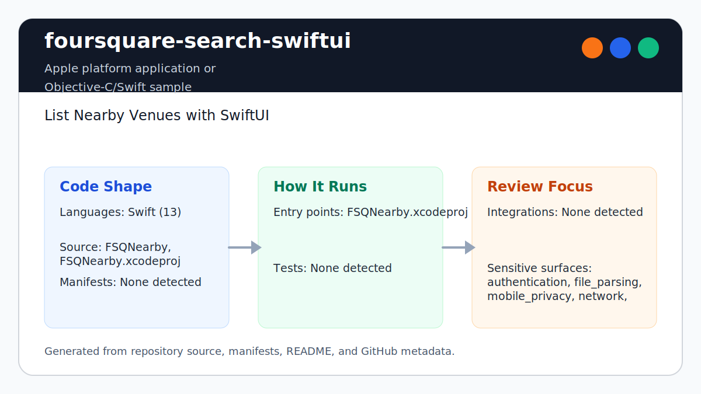

# foursquare-search-swiftui

<!-- README-OVERVIEW-IMAGE -->


## Overview

`garethpaul/foursquare-search-swiftui` is an Apple platform application or Objective-C/Swift sample. List Nearby Venues with SwiftUI

This README is based on the checked-in source, manifests, scripts, and repository metadata on the `master` branch. The project language mix found during review was: Swift (13).

## Repository Contents

- `README.md` - project overview and local usage notes
- `CHANGES.md` - concise history of maintenance changes
- `FSQNearby` - source or example code
- `FSQNearby.xcodeproj` - Xcode project file
- `Makefile` - local verification entry point
- `SECURITY.md` - security reporting and disclosure guidance
- `scripts/check-baseline.sh` - static transport, configuration, and network checks
- `VISION.md` - project direction and maintenance guardrails

Additional scan context:

- Source directories: FSQNearby, FSQNearby.xcodeproj
- Dependency and build manifests: none detected
- Entry points or build surfaces: FSQNearby.xcodeproj
- Test-looking files: no obvious test files detected

## Getting Started

### Prerequisites

- Git
- macOS with Xcode for building Apple platform projects

### Setup

```bash
git clone https://github.com/garethpaul/foursquare-search-swiftui.git
cd foursquare-search-swiftui
```

The setup commands above are derived from repository files. Legacy mobile, Python, or JavaScript samples may require older SDKs or package versions than a modern workstation uses by default.

## Running or Using the Project

- Open `FSQNearby.xcodeproj` in Xcode, choose the app or sample scheme, and run it on the matching simulator/device.
- Configure `FOURSQUARE_VENUE_SEARCH_URL` as a local HTTPS URL with a host and
  no embedded username/password or fragment. Do not commit URLs that contain
  credentials, private proxy hosts, or user-specific location data.

## Testing and Verification

Run the static baseline:

```bash
make check
```

The baseline verifies that App Transport Security is not globally disabled,
the venue-search URL is supplied through a local build setting, venue and image
loads require HTTPS URLs with hosts, optional venue fields are rendered safely,
image requests are cancelled when loaders are deallocated, and runtime
diagnostics do not use `print`. Venue search requests are also retained and
cancelled when fetchers are deallocated. Venue endpoint parsing rejects embedded
userinfo and fragments before starting a request. Image request callbacks use
weak task captures so retained tasks do not keep released loaders alive.

When the required SDK or runtime is unavailable, use static checks and source review first, then verify on a machine that has the matching platform toolchain.

## Configuration and Secrets

- `FOURSQUARE_VENUE_SEARCH_URL` supplies the venue-search endpoint.
- Keep API credentials, private endpoints, query URLs with location data,
  `.xcconfig` files, and `.env` files out of source control.

## Security and Privacy Notes

- Review changes touching authentication or token handling; examples from the scan include FSQNearby/AppDelegate.swift, FSQNearby/SceneDelegate.swift.
- Review changes touching network requests, sockets, or service endpoints; examples from the scan include FSQNearby/Info.plist, FSQNearby/Service/ImageLoader.swift, FSQNearby/Service/VenueFetcher.swift, FSQNearby.xcodeproj/project.xcworkspace/xcshareddata/IDEWorkspaceChecks.plist.
- Review changes touching mobile permissions or privacy-sensitive device data; examples from the scan include FSQNearby/Models/FoursquareSearch.swift, FSQNearby/View/AddressView.swift, FSQNearby/View/VenueItemView.swift.
- Review changes touching file, media, JSON, XML, CSV, OCR, or data parsing; examples from the scan include FSQNearby/Info.plist, FSQNearby/Models/FoursquareSearch.swift, FSQNearby/View/IconView.swift, FSQNearby.xcodeproj/project.xcworkspace/xcshareddata/IDEWorkspaceChecks.plist.
- Review changes touching shell execution, subprocess, or dynamic evaluation; examples from the scan include FSQNearby/View/AddressView.swift.
- Missing configuration, empty responses, and network failures should render a
  visible state instead of crashing or leaving a blank list.
- Venue and image URLSession tasks should stay tied to their observable object
  lifecycles.
- Image URLSession callbacks should use weak task captures before publishing
  downloaded data.

## Maintenance Notes

- This looks like an Apple platform project or sample. Xcode, Swift, CocoaPods, and deployment target versions may need to match the original project era.
- Run `make check` before pushing changes that touch network loading,
  transport settings, venue decoding, or local configuration.
- See `SECURITY.md` for vulnerability reporting and safe research guidance.
- See `VISION.md` for project direction and contribution guardrails.
- See `docs/plans/2026-06-09-foursquare-swiftui-url-host-validation.md` for
  network URL host validation guardrails.
- See `docs/plans/2026-06-09-foursquare-swiftui-image-task-lifecycle.md` for
  image request lifecycle guardrails.
- See `docs/plans/2026-06-09-foursquare-swiftui-venue-task-lifecycle.md` for
  venue request lifecycle guardrails.
- See `docs/plans/2026-06-09-foursquare-swiftui-image-weak-capture.md` for
  image request callback capture guardrails.
- See `docs/plans/2026-06-09-foursquare-swiftui-venue-url-parts.md` for venue
  endpoint userinfo and fragment guardrails.

## Contributing

Keep changes small and tied to the project that is already present in this repository. For code changes, document the toolchain used, avoid committing generated dependency directories or local configuration, and update this README when setup or verification steps change.
